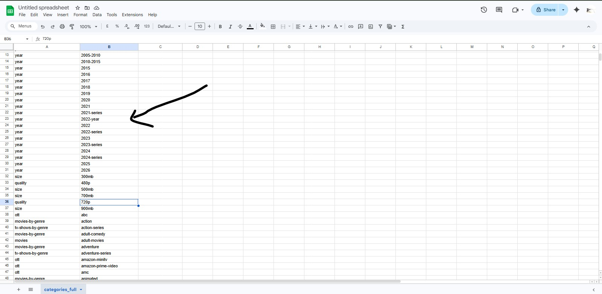
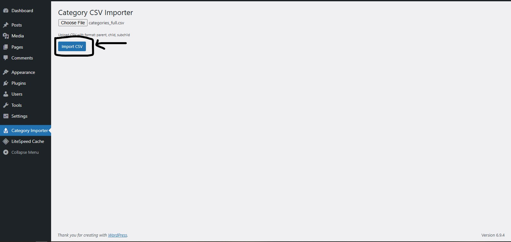
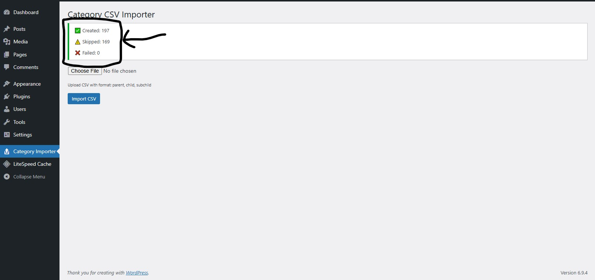
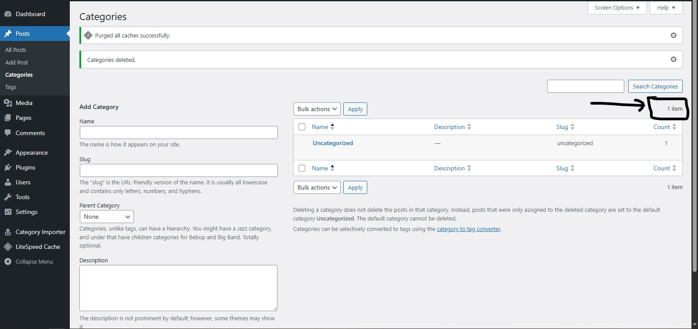
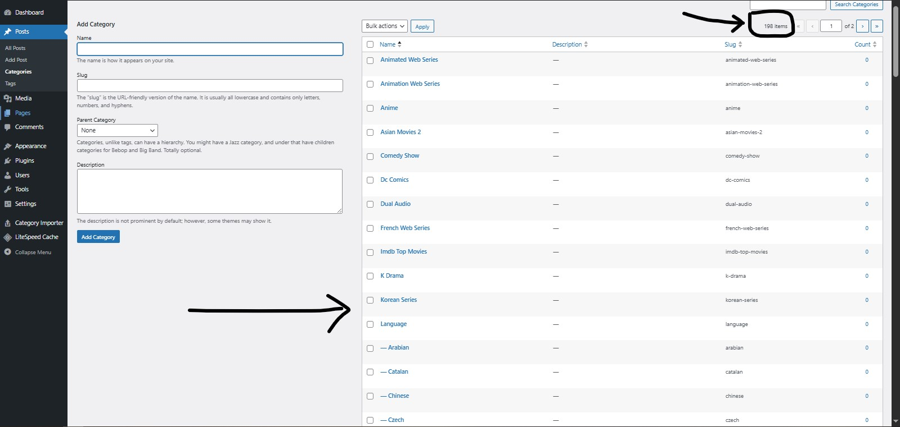

# Category Importer CSV Pro

A WordPress plugin to import hierarchical categories (parent, child, subchild) in bulk using a CSV file. Designed to handle structured taxonomy data efficiently with validation and duplicate prevention.

---

## Overview

Managing large numbers of categories manually in WordPress is time-consuming and error-prone. This plugin allows administrators to upload a CSV file and automatically create category hierarchies in bulk.

---

## Features

- Bulk import categories from CSV
- Supports hierarchy (parent → child → subchild)
- Duplicate detection (prevents re-creation of existing terms)
- Input sanitization for safe data handling
- Import report with:
  - Created entries
  - Skipped entries (already exist)
  - Failed entries
- Secure form submission using nonce verification
- CSV file validation

---

## CSV Format

The CSV file must follow this structure:
parent, child, subchild
year, 2020,
year, 2021,
quality, 1080p,
size, 1gb

Notes:
- First row is treated as header and skipped
- Parent is required
- Child and subchild are optional

---

## Installation

1. Download or clone the repository
2. Upload the plugin folder to `/wp-content/plugins/`
3. Activate the plugin from the WordPress admin panel
4. Navigate to:
   **Admin Menu → Category Importer**

---

## Usage

1. Go to the plugin page in the admin panel
2. Upload a CSV file
3. Click "Import CSV"
4. Review the import report

---

## How It Works

- Reads CSV row by row
- Sanitizes input using WordPress functions
- Checks if term already exists using `term_exists()`
- Creates new terms using `wp_insert_term()`
- Maintains hierarchy using parent IDs

---

## Import Report

After import, the plugin displays:

- Created: Number of new categories added
- Skipped: Categories that already existed
- Failed: Rows that could not be processed

---

## Limitations

- Works with default `category` taxonomy only
- Does not update existing categories
- Does not support very large files with batching (yet)

## Usage

### Step 1: Open Plugin Page

Go to WordPress Admin → Category Importer

---

### Step 2: Prepare CSV File

Ensure your CSV follows this format:

parent, child, subchild  
year, 2020,  
quality, 1080p,  

---

### Step 3: Upload CSV

Select your file and click "Import CSV"

### Step 4: View Import Results

After import, you will see a report:

- Created: New categories added  
- Skipped: Already existing categories  
- Failed: Errors

### Step 5: Verify Categories

Check categories in WordPress dashboard

